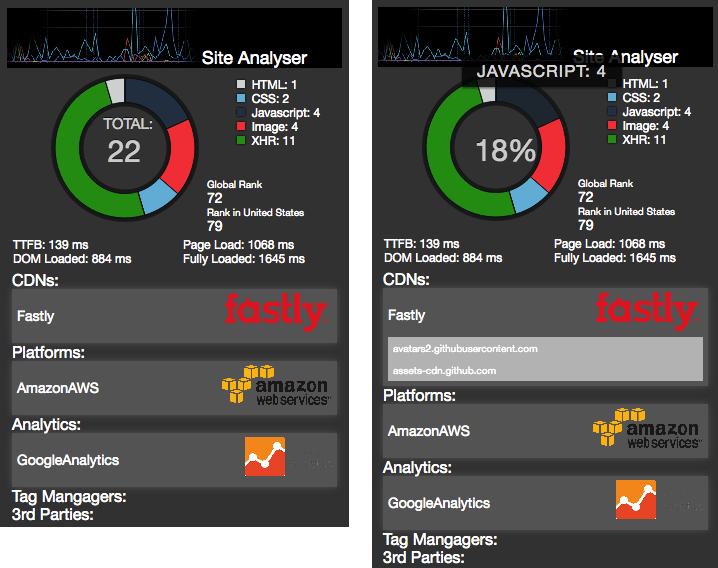

# SiteAnalyser

This Chrome extension helps find the possible CDN a site is using.  In addition, it provides site performance information, Alexa ranking, asset count breakdown, and information on 3rd party applications.  

version: 1.0

screenshots:  
  

Installation instructions:  
1. Download "Site Analyser.crx" [here](https://drive.google.com/file/d/0B7HRCA-oHQJ7SWZYOEJyUmlNQms/view?usp=sharing)  
2. In a Chrome browser, navigate to "chrome://extensions/"  
3. Drag the downloaded "Site Analyser.crx" file into the Chrome tab
